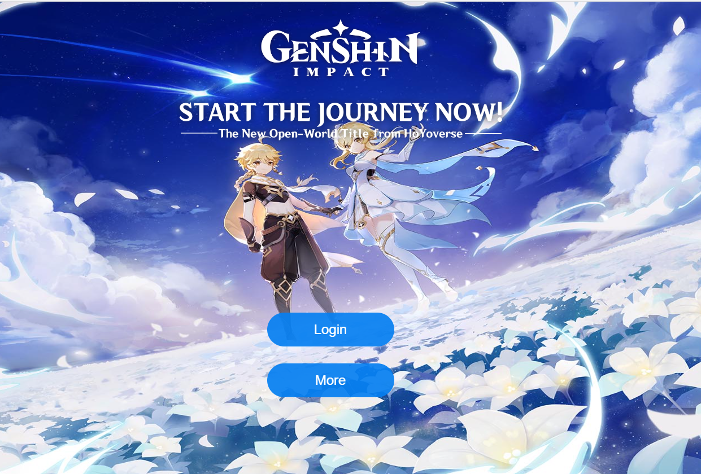
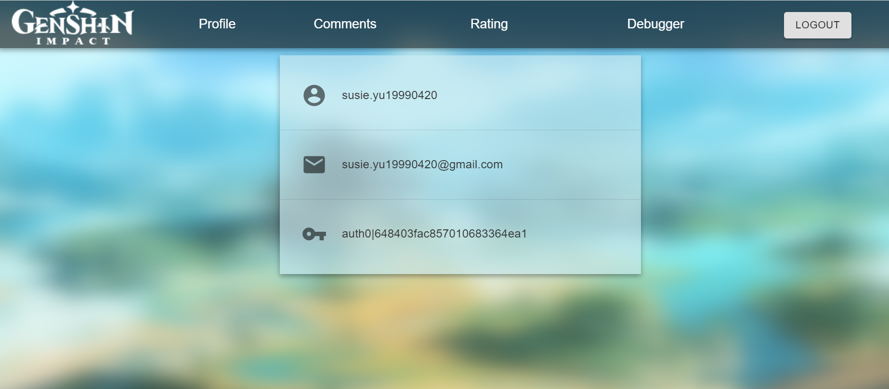
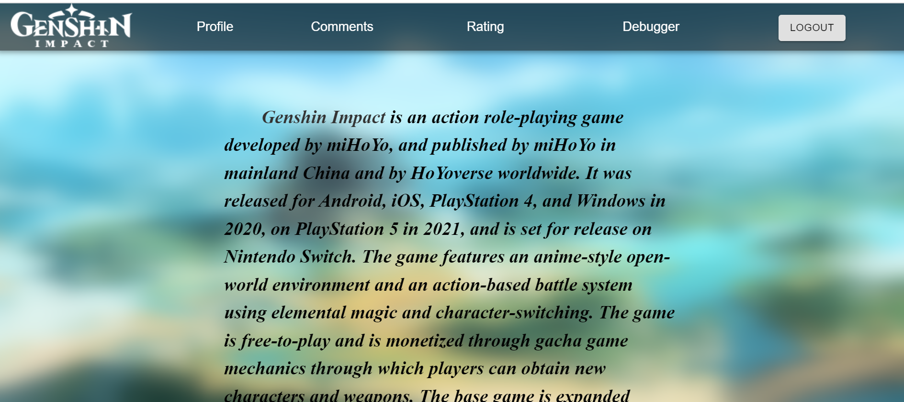
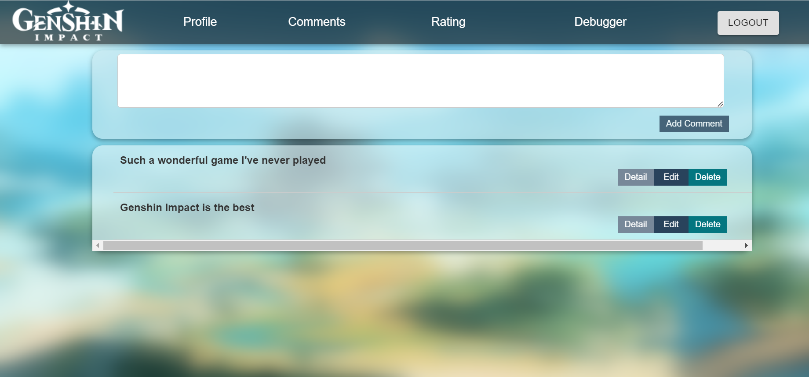
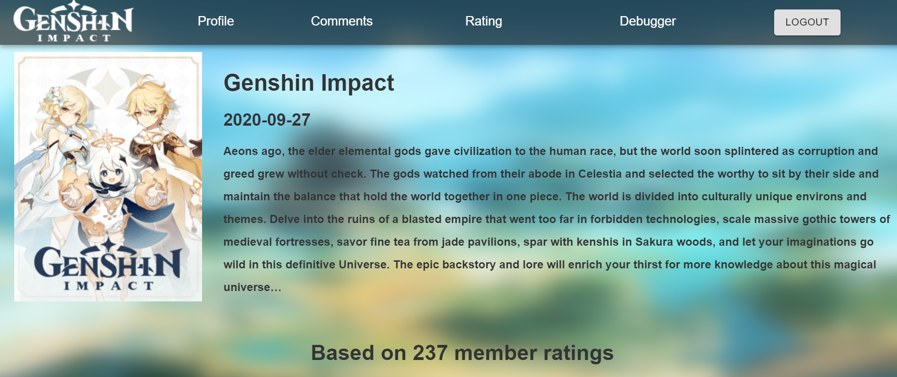

# assignment-3-3-Susiee03

## Overview
This is a React app that allow all people to see who joined the app recently. For registered users, they can view the details of a popular game - Genshin Impact, including an introduction to the game and its current overall rating.

Users can add their own comment and rating about the game. CRUD operations are enabled for comments and ratings. Feel free to visit the app by click the link: https://assignment3-iota-blond.vercel.app/ 

## Technologies
The app was developed using React, Node and Prisma. The production deployment uses Auth0 for user authentication, PlanetScale for database deployment, Google Cloud for Web API deployment, and Vercel for web hosting.

## App screenshorts displayed

## Setup and Installation
* First, git clone the repositories and save it to you local machine.
* Don't forget to add the key and Auth0 env in api, as well as the database url. 
* Then, go to the api folder, run npm install in terminal.
* Then, go to the client folder, run "npm install". If you'd like to run the app through localhost, after
setting the related .env properly, run "npm run start" will start the app locally. 

## Usage of external API
The external API we choose: https://api-docs.igdb.com/#getting-started 

We put that in game rating, it can be found under client/src/components/GameRating, line 24. 

We used the external api, to generate the basic information in Rating oage, including the game released date, game storyline shown in Rating, the number of people who rated the game, and the average rating from that external API.

